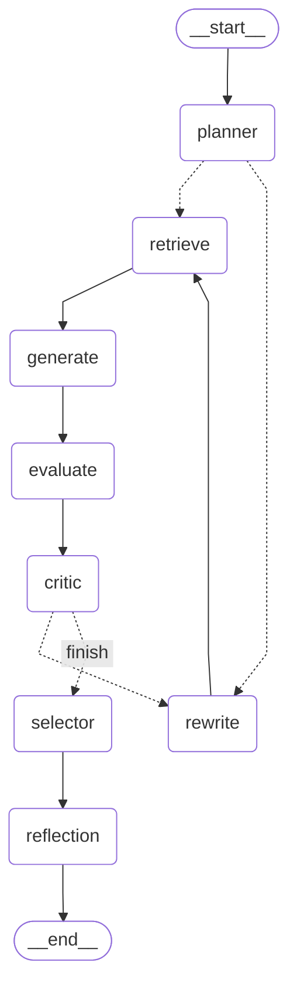

```mermaid
---
config:
  flowchart:
    curve: linear
---
graph TD;
	__start__([<p>__start__</p>]):::first
	planner(planner)
	rewrite(rewrite)
	retrieve(retrieve)
	generate(generate)
	evaluate(evaluate)
	critic(critic)
	selector(selector)
	reflection(reflection)
	__end__([<p>__end__</p>]):::last
	__start__ --> planner;
	critic -.-> rewrite;
	critic -. &nbsp;finish&nbsp; .-> selector;
	evaluate --> critic;
	generate --> evaluate;
	planner -.-> retrieve;
	planner -.-> rewrite;
	retrieve --> generate;
	rewrite --> retrieve;
	selector --> reflection;
	reflection --> __end__;
	classDef default fill:#f2f0ff,line-height:1.2,fill-opacity:0
	classDef first fill-opacity:0
	classDef last fill:#bfb6fc

```